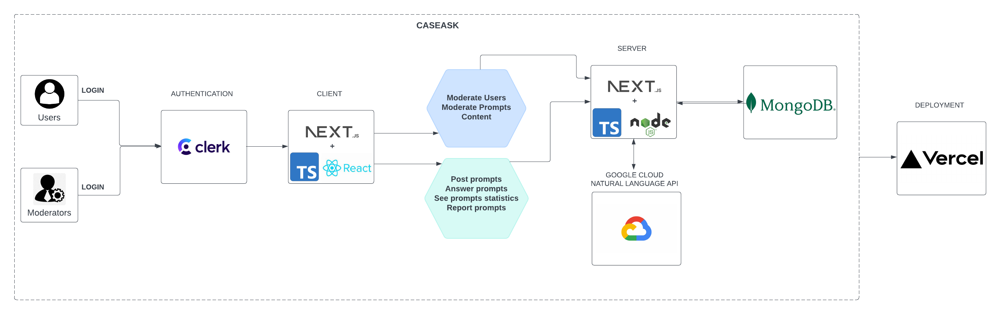

# CaseAsk

CaseAsk is a campus-wide, AI-moderated Q&A web application designed to help students ask and answer questions in a respectful, inclusive, and efficient learning environment. It features automatic content moderation using sentiment and language analysis, real-time updates, and user authentication. 

---

## Live Demo

[https://caseask.vercel.app](https://caseask.vercel.app)

---

## Architecture Overview

### System Architecture Diagram



**Main Components:**
- **Frontend:** Next.js with TypeScript
- **Backend:** Node.js API Routes (serverless)
- **Database:** MongoDB Atlas
- **Authentication:** Clerk
- **Moderation:** Google Cloud Natural Language API
- **Deployment:** Vercel

---

## Getting Started / Installation

### Prerequisites

- Node.js >= 18.x
- npm or yarn
- MongoDB URI (MongoDB Atlas or local instance)
- Clerk API credentials (Publishable and Secret Key)
- Google Cloud Natural Language API Key

### Installation Steps

1. Clone the repository:

   
```bash
   git clone https://github.com/KhanhKhuat1504/csds393_project.git
   cd csds393_project
```

2. Install dependencies:
```bash
  npm install
```
3. Set up environment variables:

Create a .env.local file and populate it with:

```bash
NEXT_PUBLIC_CLERK_PUBLISHABLE_KEY=your_clerk_key
CLERK_SECRET_KEY=your_clerk_secret
SIGNING_SECRET=your_webhook_secret
MONGODB_URI=your_mongodb_uri
GOOGLE_API_KEY=your_google_api_key
GCP_KEY_B64=your_google_api_key_in_base64
```

4. Run the development server:

```bash
npm run dev
```

The application will be running at http://localhost:3000

## Usage / Examples
For Non-Technical Users
Visit the site and sign up with email or social login.

Use the "Ask a Question" form to submit a post.

The system will auto-moderate using sentiment analysis.

Posts are displayed to the public feed if safe, or flagged otherwise.

Users can answer, like, or report questions.

## Folder Structure

csds393_project/  
├── components/            # Reusable React components  
├── pages/                 # Next.js routes including API endpoints   
│   ├── api/               # Serverless backend functions   
├── lib/                   # Utility and helper functions   
├── public/                # Static assets  
├── styles/                # CSS modules and global styles  
├── tests/                 # Unit tests   
├── docs/                  # Architecture diagrams, generated docs  
├── .env.local             # Environment variables  
├── README.md              # This file  

## Tech Stack / Dependencies  
Frontend: Next.js, React, TypeScript  

Backend: Node.js, REST API (via Next.js API Routes) 

Database: MongoDB Atlas 

Authentication: Clerk.dev 

Moderation: Google Cloud Natural Language API 

Testing: Jest, React Testing Library  

Deployment: Vercel  

Other Tools: ESLint, Prettier, GitHub Actions (CI), JSDoc 

## Contribution

Khanh: Worked on Clerk Auth, Backend, AI feature and Deployment   
Evan: Worked on Clerk Auth, Frontend, Style, and Moderation   
Ricky: Worked on frontend and debug the frontend and backend api  
Tahir: Backend, and Database management   

## Development Retrospective
What Could Be Improved

## Testing
This project uses Jest and React Testing Library for unit testing frontend components and backend API routes.

Run tests:

```bash
npm run test
```

## testing.md Summary
Unit tests are located in the /tests directory.

Components tested:

User Authentication

Question Submission

Answer Submission

AI Moderation logic

Flagging/Inappropriate Post handling

Test Coverage
We cover ~85% of major flows: posting, answering, flagging, and moderation.

Auth-related flows are tested using Clerk’s mocked responses.

## Source Code Documentation
All classes, functions, and modules include Google-style docstrings.

Documentation generated using JSDoc.

Generate docs:
```bash
npx jsdoc -c jsdoc.config.json
```

Generated HTML docs are located in:

/docs/html/index.html


## License
This project is open-source and licensed under the MIT License.

## Contact

